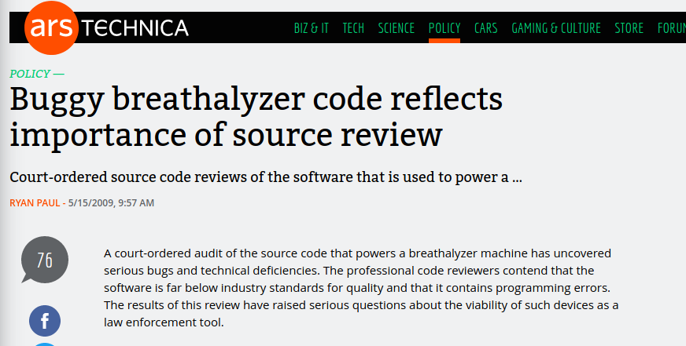
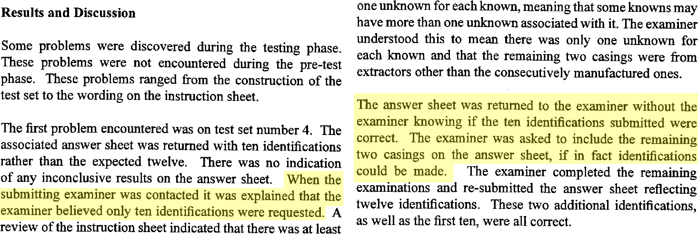
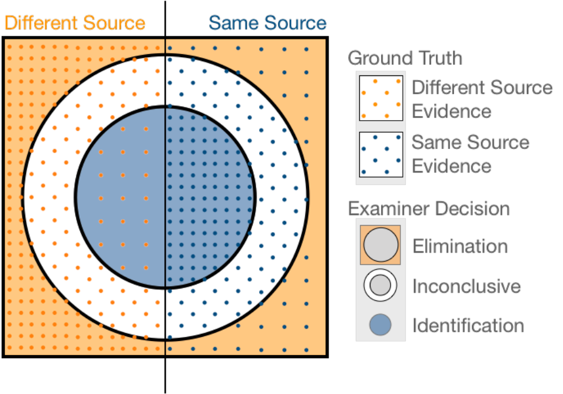
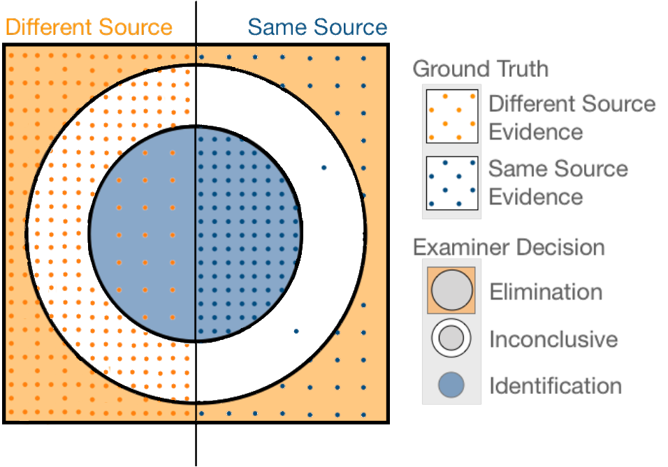

---
class:inverse
# Issue 1: Scientific Foundations of Firearms Examination

---
class:primary
## Scientific Foundations

> Conclusions drawn in firearms identification should not be made to imply the presence of a firm statistical basis when none has been demonstrated

What would we need? According to Spiegelman & Tobin (2013)

- Every rifled firearm brand
  - different production settings, batches, tempering methods, barrel alloys
- Different ammunition types and sizes
- Different break-in periods for the guns
- Different maintenance procedures and lubrication types

???

The reports all say that there is insufficient scientific basis for pattern discipline analysis, but what does that mean? In theory, they mean that we don't have any idea what the distribution of these marks would look like, whether there are factors that might cause the marks to be similar, etc. We don't sufficiently understand the population characteristics. Some people advocate for a full-on factorial screening experiment to nail this down -- but that would involve a huge amount of work.

--

Examine multiple fired bullets/cartridges from **each combination of factors** to determine if the markings are unique. 

Compare features of the markings across caliber/material to differentiate class characteristic comparisons from individualizing marks


???

Sometimes, this type of experiment is proposed to get a database of bullets which can be compared to determine an upper bound on the random match probability (e.g. if nothing matches, then the RMP is less than 1 over the number of different-source pairwise comparisons in the database). 

I'm all for data collection, don't get me wrong, and CSAFE does plenty of it. But, combinatorial experiments aren't the only way to get a reasonable empirical foundation for firearms analysis. 


---
class:primary
## Scientific Foundations

Current status: most studies use consecutively manufactured parts

- Believed to be as similar as two parts can get
- If methods can distinguish very similar patterns, they can discriminate patterns that are dissimilar

Examiners focus on bounding the error, rather than fully understanding the variability.

???

The previous slide showed how a statistician might tackle the problem, but the approach examiners take to showing the validity of the discipline is more similar to approaches found in engineering. There, because there are too many variables to accurately work with simultaneously, they determine which set of variables is the most limiting, and show that under those conditions, things work.

This is what examiners are doing. They have identified that if the method can't distinguish between consecutively manufactured parts, then it won't work at all. Thus, then, they only need to study consecutively manufactured weapons, and they don't have the full sample space to work with.

Given that it is *really* hard to systematically collect all of the data you'd need to estimate the random match probability and the random mismatch probability, this might be the best we are going to do.

In any case, addressing the question of scientific validity from a head-on approach is not particularly easy. Procrastination is a valid form of the scientific method, right? Lets put this off until we have the ability to actually deal with it head on.

Instead of approaching the scientific foundations, we approach the other two issues - the subjectivity and the error rate quantification.

--

We can't compute a random match probability from current studies, but does that mean that the discipline is not scientific?

???

That may not be a fully scientific approach, but it isn't unscientific either - we celebrate John Snow removing the pump handle during a cholera outbreak, even though he didn't know what agent caused the cholera. He used the data he had to identify the source of the outbreak, and that was enough to solve the problem. 

Making decisions from empirical data is certainly a statistical basis; it may not be as firm as we'd like, but it might be as good as we're going to get.

---
class:inverse
# Issue 2: Examination is 100% Subjective

???

The next issue is that the comparisons are subjective. They're done inside the examiner's brain, using visual information, and there is very little quantitative or objective information to use to justify the decision. 

CSAFE has been working to develop a statistical model which looks at features that are similar to those used by examiners (e.g. mimicking the perceptual process) but that can be quantified and viewed objectively. The next two slides describe work predating my involvement in the project, but it's critical to later work that I'm involved with. 

---
class:primary
## Subjectivity

Hare, Hofmann, and Carriquiry (2017) proposed a method for automated bullet matching

.pull-left[
```{r results='asis', echo = F, include = T}
cat(img_modal(src = "images/HS36-Bullet-With-Crosscut.png", alt = "Bullet land scan, with crosscut"))
cat(img_modal(src = "images/Combined-cross-section.png", alt = "Crosscut and profile"))
```
].pull-right[
```{r results='asis', echo = F, include = T}
cat(img_modal(src = "images/signature-combined.png", alt = "Bullet smooth and resulting signature"))
cat(img_modal(src = "images/signature-aligned.png", alt = "Aligned bullet signatures"))
```

]

???

The automatic bullet matching method developed at CSAFE consists of some dimension reduction steps: 

First, we find a horizontal band that is as low on the bullet as possible (because the striae are deeper) but high enough to have stability and extend across the land 

Then, we average across the values in that band to smooth things out a bit.

We identify the grooves and remove that data from consideration, which is important because the next step is to fit a smooth curve to the surface, and the grooves mess that up a lot. 

We work with the residual values, which flattens out the striae so that the curvature of the bullet is not an issue. 

Then another smoothing function is applied (with a much smaller window) to minimize the effects of high-frequency noise. This is what we call a "signature"

Two signatures are aligned using the maximal cross-correlation - basically, shifting them against each other until the correlation between the sequences is maximal. Computationally, this gets tricky when missing values are introduced, because the usual fourier-based methods don't work with missing values.

--

.move-margin[
Numeric features derived from aligned signatures 

Features used to train a random forest

Random forest votes used to assess similarity
]

???

Once the signatures are aligned, we can compute a number of features. We identify striation marks on each signature and count the number of striations that overlap between two aligned signatures. 

These features were used to train a random forest using several test sets scanned at NIST. Then, for new values, we can use that fitted random forest model to predict whether an aligned set of signatures is or is not a match. 


---
class:primary
## Subjectivity

Random Forest initially trained on data from the [NIST Ballistics Toolmark Research Database](https://tsapps.nist.gov/NRBTD/Account/Login)
  - 2 sets of 35 bullets from the "Hamby" studies used for FTE training
  
  - Both sets use the same 10 consecutively rifled Ruger P-85 barrels
  
  - Digital scans with resolution of 1.5625 $\mu m$
  
How well does the Hare, Hofmann, and Carriquiry algorithm generalize to external test sets using other (similar) firearms?

???

To train this algorithm, they needed data. While CSAFE now has microscopes that generate more than a TB of data each semester, back then they didn't, so they got scans from NIST that were lower resolution than their current scans. The sets they chose are derived from the same consecutively manufactured 10 guns (so as similar as you can get 10 guns), and all of the guns are of the same type. So not a lot of external validity, right? 

Firearms studies often use consecutively manufactured components because it is believed that consecutively manufactured pieces are more similar to each other than nonconsecutive versions; thus, if the methods work on consecutively manufactured components, they will work on nonconsecutive components. It's logical, but it also means that in order for this random forest model to be useful in practice, we'd have to be comfortable using it on data which is well outside the training data.

---
class:primary
## Subjectivity

> [Vanderplas, Nally, Klep, Cadevall, & Hofmann (2020) Comparison of three similarity scores for bullet LEA matching. Forensic Science International](https://doi.org/10.1016/j.forsciint.2020.110167)

- 3 different test sets
    - Houston Forensic Science Center - 3 test kits, 23 bullets each (3x5 barrels, 8 unknowns)
    
    - Phoenix Police Dept - 34 bullets (3x8 barrels, 10 unknowns)
    
    - Hamby 44 - 35 bullets (2x10 barrels, 15 unknowns)

- higher resolution scans (0.65 $\mu m$; training data: 1.5625 $\mu m$)

- different firearms (Ruger P-85, Ruger P-95, Ruger LCP)

- different types of ammunition

???

One of the projects I've worked on was to examine how well the algorithm works on external test sets. Random forests can generate out-of-bag predictions, but fundamentally, in order to use this algorithm, we have to see how well it generalizes to different ammunition, different firearms, different microscope settings...

So we decided to test the algorithm using 3 different test kits developed by firearms examiners. Each set uses Ruger firearms, but they are different models which have different surface treatments and manufacturing processes. Each set also uses different ammunition. One of the sets is a third Hamby set, so using the same 10 barrels, but a different set of 35 bullets, as the training sets. 

All of the scans were done at CSAFE using the high-resolution microscopes, so they are different on a number of different respects from the original training data.

---
class:primary
## Subjectivity

Comparison of 3 different quantitative measures for bullet LEA matching:
- Consecutive Matching Striae (CMS)

- Cross-correlation (CCF)

- Random forest score (RF)

**Goals:**

- Quantify error rates on external test sets

- Scores should be monotonic (higher = more likely to be same source)

- Optimal cutoff (EER) should be stable across different firearms (ideally)

???

For each set, we compared 3 different measures of match strength. Consecutive Matching Striae (CMS) are used by some examiners to quantify match strength in court. It is believed that having more than 6 consecutively matching peaks is enough to practically eliminate the possibility of a coincidental match. That's based off of a study from the 1950s on 24 Smith & Wesson revolvers, and is held as practically incontrovertible despite the lack of generality. 

The problems with scientific validation of toolmark examination are pretty pervasive.

We also used straight cross-correlation, which is the method promoted by NIST for assessing match strength.

Finally, we used the random forest score, which includes CMS and cross-correlation as inputs. 

The goal is to quantify the error rates on external test sets, examine how well the method generalizes, and see how stable the equal-error-rate cutoff is for different firearms. Ideally, we'd want a cutoff that would work for any comparison, because in casework we don't have a whole set of test data to use for comparison purposes so that we can determine the cutoff.

This paper is basically the equivalent of buying a new car and then taking it out to the country to see how fast it goes and how well it works. 


---
class:primary
## Subjectivity
.center[
```{r results='asis', echo = F, include = T}
cat(img_modal(src = "images/hou-1.png", alt = "Houston Set 1", other=list(width="60%")))
cat(img_modal(src = "images/hou-2.png", alt = "Houston Set 2", other=list(width="60%")))
cat(img_modal(src = "images/hou-3.png", alt = "Houston Set 3", other=list(width="60%")))
```
]
.move-margin[Future work: <br/>A paper comparing the matching algorithm's performance to examiner performance on the Houston FSC test sets.]

???

For each test set, we looked at both bullet-to-bullet results, like those shown here, and land-to-land results, which are a bit finer. To get bullet-to-bullet results, we looked for a sequence of matches between bullet 1 and bullet 2, and took the average of the sequence with the highest matching values. Since scans are done at the land level, we can also look at how the random forest performs there; we can expect more variability for those comparisons.

The Houston study just concluded, so we're hoping to write a paper soon comparing the algorithm's performance to the FTE performance. From what we've been told, the algorithm did pretty well, and the algorithm combined with human judgement was perfect. The human judgement is necessary because sometimes the automated decisions in the algorithm don't work, rendering downstream results invalid. If we visually examine the intermediate data (using a tool we developed for that purpose), it is possible to identify the issues, flag those comparisons, and exclude them from consideration; doing this automatically is hard, but it's easy for a human. 

It's important to be able to decide when you do and don't trust your model's predictions, and that's basically what we're doing in that step. Since there is some subjectivity there, we report both versions.


---
class:primary
## Subjectivity

```{r results='asis'}
i1 <- img_modal(src = "images/compare-1.png", alt = "Bullet-to-Bullet Average Score Discrimination", other = list(width="46%"))
i2 <- img_modal(src = "images/compare-land-to-land-1.png", alt = "Land-to-land Score Discrimination", other = list(width="50%"))

c(str_split(i1, "\\n", simplify = T)[1:2],
  str_split(i2, "\\n", simplify = T)[1:2],
  str_split(i1, "\\n", simplify = T)[3:12],
  str_split(i2, "\\n", simplify = T)[3:12]) %>% paste(collapse = "\n") %>% cat()

```

- Complete separation of whole-bullet scores for both RF and CCF

- CMS are terrible at the land to land level

- The RF score has better separation on most land-to-land measures than CCF

???

In any case, if we compare the bullet to bullet scores on the left, we have complete separation between the random forest and cross-correlation scores of same-source and different source matches. Unfortunately, we don't have the same cutoff for each set, indicating that our model predictions are sensitive to the specific type of firearm and ammunition... but not unusably sensitive. 

Consecutive Matching Striae doesn't have nearly as much separation, and in fact has considerable overlap. However, if 6 is the threshold used, it will never result in the identification of a same-source pair - that is, the false positive rate is very low, but the false negative rate is extremely high when using CMS.

Because there's complete separation in the bullet-to-bullet scores, it's not particularly useful to use ROC curves to characterize the performance of the algorithm. We have to go to the land-to-land scores to be able to get a more precise idea of how the random forest and CCF scores compare.

Here, what we see is that there is some bimodality in the CCF and RF scores, particularly when looking at same-source pairs. These low land-to-land scores indicate that some characteristics either don't match or don't correspond (for instance, sometimes, the bullet gets compressed in a way that causes the striae to stretch or compress a bit, reducing cross-correlation significantly even though visually you can see clear correspondence between the peaks). So if the land-to-land score is high, it's almost definitely a match, but if it's low, we need to look at a few other lands to determine how well things match up. But, the cutoffs at the land-to-land level are actually similar for each test set - if the RF score is above 0.5, it's probably a same-source pair, while if the CCF is above roughly 0.75, it's probably a same-source pair.

The other thing to note here is that the separation between the distributions is much greater for the random forest than for the cross-correlation: so even though they've got roughly similar accuracy, the random forest has much better separation.

---
class:primary
## Subjectivity

```{r results='asis'}
i1 <- img_modal(src = "images/roc-auc-1.png", alt = "ROC Curves", other = list(width="49%"))
i2 <- img_modal(src = "images/roc-auc-2.png", alt = "Area under the curve (AUC) with 95% CIs", other = list(width="49%"))

c(str_split(i1, "\\n", simplify = T)[1:2],
  str_split(i2, "\\n", simplify = T)[1:2],
  str_split(i1, "\\n", simplify = T)[3:12],
  str_split(i2, "\\n", simplify = T)[3:12]) %>% paste(collapse = "\n") %>% cat()

```

???

looking at the land-to-land scores under an ROC curve, we can see that the performance of CCF and  RF is very similar in each test group - sometimes RF slightly wins (e.g. on Hamby44) but overall it's pretty consistent. CMS is much less useful.

If we compute the area under the curve for each set, we find that CMS is consistently significantly different from the other two methods, but that those methods aren't meaningfully different from each other. 

Interestingly enough, for both the random forest and cross-correlation scores, performance is poor on the Hamby44 set... which is from the same 10 barrels used to train the algorithm! The other set that it's bad on is the Houston FSI G2 set, which has some issues with partial signature compression. We're still figuring out how to alter the processing to handle that. 

<!-- --- -->
<!-- class:primary -->
<!-- ## Forensic Software -->

<!-- - Many forensic products are closed source -->

<!--     - TrueAllele tests for DNA mixture analysis - results can't be shown to be faulty in court without the source code -->

<!--     - Breathalyzer software [found to be faulty](https://arstechnica.com/tech-policy/2009/05/buggy-breathalyzer-code-reflects-importance-of-source-review/) -->

<!--     - Inability to replicate results of other proposed automated methods - insufficient details in the paper about data cleaning and preprocessing -->


<!--  -->


---
class:primary
## Forensic Software

- [National Integrated Ballistic Information Network](https://www.atf.gov/firearms/national-integrated-ballistic-information-network-nibin) (NIBIN)
    - closed hardware
    - closed-source software
    - used by most forensics labs to identify matches in bullets and cartridges across jurisdictions
    
***

- x3p file format: OpenFMC (Open Forensic Metrology Consortium) ISO standard format

- [x3ptools](https://heike.github.io/x3ptools/)
    - R package for working with bullet and cartridge scans (or any other surface scan)

- [bulletxtrctr](https://heike.github.io/bulletxtrctr/)
    - R package implementing the matching algorithm and feature extraction process for bullets

.move-margin[


]

???

Closed-source software is a real problem in the legal system - proprietary code isn't something you can examine for errors and may or may not have been developed with good software engineering practices. NIST doesn't release source code either, and the NIBIN system used by the federal government is closed hardware and software. 

One of the ways CSAFE is addressing the problems with closed-source software is by releasing open-source software packages of both our algorithms and other algorithms published in the community. The software is released under MIT or GPL licenses, which prevent us from being liable for errors, but we also do our best to ensure that the algorithms work as advertised. 

I was involved in the construction of both x3ptools and bulletxtrctr, refactoring the code from the bulletr package described in the original random forest paper so that it was more reliable, maintainable, and modular. I've also written validation tests for both packages to ensure that each line of the code does what it is designed to do, so that changes in the future are less likely to break the already-implemented functionality. One of my students at Iowa state is working on a similar implementation of someone else's algorithm for cartridge cases; after implementing it, we're going to fix it so that it works properly. 

So one way we're addressing errors is to make software auditable, so that if there are errors in the software, anyone can find them. It's not in the public's interest to have software bugs go unnoticed. 

---
class:inverse
# Issue 3: Screw-Ups (Error Rates)

???

Forensic evidence is also mistrusted because the error rates for such assessments are often under-estimated or minimized in court. In addition, the studies that exist have significant methodological problems. So lets talk about why this matters to the legal system first, then take a look at the problem.

---
class:primary
## Screw-Ups <br/>(Error Rate Estimates)

To be admitted in court, examiner testimony must pass the **Daubert standard** as codified in Rule 702 of Federal rules of evidence
- Relevance - the method is relevant to the evidence
- Reliability - the method rests on a reliable foundation
- Scientific Knowledge - the method is based in scientific methodology. 

Important factors for scientific methodology:
- general acceptance by the community
- method has been through peer review and publication
- method can be tested
- the known or potential error rate is acceptable
- the research was conducted by unbiased individuals (e.g. the testing wasn't just for the specific court case)

???

One of the primary debates right now is whether pattern evidence can be admitted into court, and what degree of certainty the examiner is allowed to convey to the jury. Part of this issue comes from the legal standards for admissibility - because pattern evidence has a shaky scientific foundation, it is sometimes judged to be inadmissible in court. 

Another factor is the known error rate for a technique. It's important to note here that common law courts work on precedent, so it is very hard for them to change course and say "this isn't scientifically valid, so you can't use it" when there is precedent. So change is very, very slow, but it is starting to happen.

So lets take a look at these error rate studies. 
    
---
class: primary
## Screw-Ups <br/>(Error Rate Estimates)

Ideal study characteristics:

- Sufficient comparisons and number of examiners to generalize well to the entire field

- Varying numbers of same-source and different-source comparisons  .small[to prevent examiners from guessing or getting information from colleagues about test set composition]

- Tests should have single pairs of evidence from one known source, with and one unknown for comparison
  - Ensures no additional information is available to examiners
  - Similar to most common casework scenario

- Examiners should use the same criteria for evaluating the evidence

- Examiners should not know they're being tested

???

The PCAST report (and addendum) summarized the problems with existing error rate studies; there are possibly as many as 2 well-known studies in the entire field of firearms and toolmark analysis that meet half of the experiment design guidelines listed here. Firearm and toolmark analysis includes analysis of ejector marks, firing pin impressions, and breech face impressions on cartridges, and land engraved areas on bullets, as well as chisel marks, screwdrivers, tin snips, and any other variety of tool you might come across. So the lack of well-designed studies is pretty damning. 

These guidelines are pretty basic experimental design/experimental control principles. Unfortunately, they're also contradictory, since examiners who are forced to use different critera than normal are going to know it is for test purposes.

I'm sure this will shock you all, but it's also important to do tests that are broad - it isn't enough to just test the 8 examiners in the FBI laboratory and generalize that to all examiners in the US. Also, unlike the definition in more than one study... blind studies are studies where the examiner doesn't know it is a test; they are not studies where the examiner doesn't know the answers. 

---
class:primary
## Inconclusives and <br/>Error Rates
<table>
<tr><th></th><th colspan=3>Examiner Decision</th></tr>
<tr><th>Ground Truth</th><th>Identification</th><th>Inconclusive</th><th>Elimination</th></tr>
<tr><th>Same Source</th><td> a </td><td> b </td><td> c </td></tr>
<tr><th>Different Source</th><td> d </td><td> e </td><td> f </td></tr>
</table>

Options: 

1. Condition on "Not Inconclusive" - c and d are errors,     
compare to a + d + c + f

2. Inconclusives are Correct (AFTE) - c and d are errors,     
compare to a + b + c + d + e + f

3. Inconclusives are Errors - b, c, d, e are errors,     
compare to a + b + c + d + e + f

Option 3 describes the error in the examination process; option 2 describes examiner error alone.

???

In any study, we'd expect results to look something like this. 

If we want to examine the overall error rate, we have 3 options to handle the inconclusives: we can condition them out, we can consider them correct, or we can consider them to be errors.

The original plan when we started surveying studies was to discuss what happened to the error rate when we switched from Option 2 to Option 3 - that is, when we include the errors in the process of firearms examination (including recording the evidence), and not just the errors made by the examiner. 

When we started this project last month, we were expecting to go through the most cited studies and compute the error rates under each scenario, then discuss which rates might be suitable for which legal situations. What we found was something entirely different. 

First, the study design issues were possibly under-stated. Second, there is another problem with the results from these studies... see if you can spot it as I run through the best and worst studies we found.

---
class:primary
## Error Rate Estimates<br/>The Good

Keisler et al. (2018) Isolated Pairs Research Study, AFTE Journal

- 9 Smith & Wessons
- 20 pairs of one known and one unknown cartridge
  - 12 same-source, 8 different-source
- 126 participants

<table>
<tr><th></th><th colspan=3>Examiner Decision</th></tr>
<tr><th>Ground Truth</th><th>Identification</th><th>Inconclusive</th><th>Elimination</th></tr>
<tr><th>Same Source</th><td> 1508 </td><td> 4 </td><td> 0 </td></tr>
<tr><th>Different Source</th><td> 0 </td><td> 203 </td><td> 805 </td></tr>
</table>

???

This study was one of two with a halfway decent experimental design. Participants evaluated 20 pairs of cartridge cases, where one was from a known source, and one was from an unknown source. In each set of 20 pairs, 12 were from the same source, 8 were from a different source. 

The nice thing about this study design is that we can say for sure that there were 20 comparisons done - the design doesn't allow for any logical reasoning to cut down on comparisons. 

--

- Not blind
- Fixed proportion of same-source comparisons
- Examiners used lab rules for classification (more variability)

???

The problems are pretty minor - examiners used lab rules for classification, so some examiners could not make eliminations at all. The study wasn't blind, and there was no variation in the proportion of same and different source comparisons, so examiners could talk to each other (or just assume that the split was a nice, round number). 

---
class:primary
## Error Rate Estimates:<br/>The Good

Baldwin et al. (2014) A Study of False-Positive and False-Negative Error Rates in Cartridge Case Comparisons. Ames Laboratory report

- 25 Ruger SR9s
- Each participant evaluated 15 comparison sets of 3 knowns and 1 unknown
  - 5 same-source, 10 different-source
- 218 participants

<table>
<tr><th></th><th colspan=3>Examiner Decision</th></tr>
<tr><th>Ground Truth</th><th>Identification</th><th>Inconclusive</th><th>Elimination</th></tr>
<tr><th>Same Source</th><td> 1075 </td><td> 11 </td><td> 4 </td></tr>
<tr><th>Different Source</th><td> 22 </td><td> 737 </td><td> 1421 </td></tr>
</table>

???

This study used a more convoluted design, but is essentially the same as the Keisler study. There are a couple of changes - they included 3 cartridges for each "known" source to allow examiners to evaluate how well the gun "marks" - so examiners got more information. Also, they managed to design this so that you couldn't get any information by comparing across sets. 

The other big plus of this study is that they included more different-source comparisons than same-source comparisons, which mimics case work and allows them to more precisely pin down the probability of false positive errors.

--

- Not blind
- Fixed proportion of same-source comparisons
- Lab rules used *contrary to the test instructions*

???

The downsides of this study are the same as in Keisler. You may be wondering why examiners are allowed to use lab rules, and the answer is that they have to follow the lab procedure for everything they do. Also, the number of examiners isn't *huge* and they won't participate in studies that force the use of a specific evaluation criteria. Examiners deal with huge case backlogs, and while they recognize that proficiency tests and error rate studies are important, they are able to be selective about which ones they do.

---
class:primary
## Error Rate Estimates:<br/>The Bad

Brundage-Hamby study: Hamby et al. (2019) A Worldwide Study of Bullets Fired From 10 Consecutively Rifled 9MM RUGER Pistol Barrels. Journal of Forensic Sciences.

- 10 consecutively manufactured Ruger P95 barrels
- Closed set study: 2 x 10 knowns, 15 unknowns
- 697 participants

<table>
<tr><th></th><th colspan=3>Examiner Decision</th></tr>
<tr><th>Ground Truth</th><th>Identification</th><th>Inconclusive</th><th>Elimination</th></tr>
<tr><th>Same Source</th><td> 10447 </td><td> 8 </td><td> 0 </td></tr>
<tr><th>Different Source</th><td> 0 </td><td> ? </td><td> ? </td></tr>
</table>

???

Ok, so the first thing to know is that this study has been going on for about 40 years at this point. It predates any of the major critiques of forensics by a lot. And that's probably the last nice thing I can say about it.

The Hamby studies include 2 known samples from each of 10 barrels, with 15 unknowns that are also from those 10 barrels. The barrels are consecutively manufactured, so as similar as possible. The study is what's known as a "closed set" - you know ahead of time that each of the unknowns matches a known.

--

- Not blind
- Closed set study (logic puzzle + examination)
- Focus is only on identification, not elimination
- Indeterminate number of different source comparisons

???

As a result, there's no way to estimate how many comparisons were done. Unlike in Keisler or Baldwin, you could have up to n choose 2 unique pairwise comparisons (treating the duplicate knowns as if they were a single unit), but as soon as one of those comparisons results in a match, you know the unknown bullet isn't going to match anything else. As a result, you can only estimate the distribution of the number of comparisons. 

In addition, there's no way to estimate the number of correct different-source comparisons, nor the number of inconclusive different source comparisons. The study design is systematically biased to only estimate the false positive rate. When they report errors, they only look at the false positive rate -- which means they aren't reporting something that would be helpful to the defense in any way. It's a systematic bias that's pervasive enough that the study design itself reinforces it.

This design is one of the most common designs emulated when examiners do their own studies. Thus, examiners generally know what's coming and what the study structure is going to be ahead of time. 


---
class:primary
## Error Rate Estimates:<br/>The Ugly

Lyons (2009) The Identification of Consecutively Manufactured Extractors, AFTE Journal.



???

Finally, there are some studies out there that are just completely useless. Lyons has the same structure as Hamby, but looks at extractor marks on cartridges. This study is the study that is used to establish extractor marks as a valid comparison... and one of the most glaring methodological issues is that they actually gave someone who misunderstood the instructions a second pass. There are a couple of other issues with this study, but when you read something like that in a published paper that has been cited in court, you just have to stop reading to protect your own sanity. 

So did anyone spot the other issue? What did you see?

---
class:primary
## Inconclusive Problems

If inconclusives are a category that is necessary to describe situations where the bullet did not mark well, $P(SS|\text{Inconclusive}) \approx P(SS)$

.footer[

]

???

In addition to noticing the bias towards the prosecution in the design of many of these studies, we also noticed that there were issues with how inconclusives were used. 

AFTE's theory is that bullets sometimes don't mark well enough for comparison. Sometimes the evidence just isn't properly recorded. The problem is, you wouldn't expect the rate of that happening to be distributed differently across same-source and different-source comparisons - if a bullet doesn't have enough characteristics to exclude, it should also not have enough to match, right?

If you look at this picture, you see that the rate of inconclusives across the two sets of comparisons is the same - this is what we'd expect to see.


---
class:primary
## Inconclusive Problems

Instead, what we see is more like this:
.footer[

]

.move-margin-wide[
Across multiple studies,

- P(SS | Inconclusive) $\approx 0.02$

- P(DS | Inconclusive) $\approx 0.98$

Reasons:
- Lab rules

- Bias towards prosecution

- ???

]


???

What we actually see, however, is more like this. There are almost no inconclusives at all when making a same source comparison, and there are many inconclusives when making a different source comparison.

Some of this is that there are lab rules prohibiting elimination on the basis of individual characteristics, but regardless of the reason for why this effect occurs, it is a sign of significant bias in the system. Examiners don't need as much evidence to make an identification as they need to make an elimination - that is, they're happy to help convict you but not to exonerate you.

This was something we really didn't expect to find. To be honest, it rather derailed the writing of the paper we'd intended. 

---
class:primary
## Error Rates and Testimony

- Courts are disallowing identifications in jurisdictions across the country

- Reporting error rates as conditional on the examiner's decision provides more relevant information
    - $P(\text{Different Source} | \text{Identification})$, $P(\text{Same Source} | \text{Elimination})$
    
- Language used for identifications is an issue because of the scientific foundations
    - we can't be *sure* that things came from the same gun
    - with good experiments, examiners can report P(SS|Identification), which is generally > 99%
    
???

So if we go back to the legal context, we know a few things. Courts, which are precedent-based, are slowly starting to challenge firearms and toolmark identifications - that is, they are restricting examiner testimony that evidence X came from source Y to the exclusion of all others. 

Most of the time, they still allow examiner testimony, they just can't make statements that imply certainty or make it sound like there is probabilistic evidence to back the claim.

When error rates are reported in court, they are usually reporting the false positive or false negative rate, or an overall error rate that excludes inconclusives. Occasionally, they'll report the probability that something is an identification given that it was from the same source, or the equivalent different source/exclusion probability. 

That should change, but it doesn't have to raise the error rates. What we suggest is instead reporting the probability of an error conditioned on the examiner's decision. The advantage to this is that it provides precise information about the error rate in the relevant situation, and that you're conditioning on information that is known in casework, rather than conditioning on the source, which is unknown.

It also has the advantage of removing inconclusives from the equation in most cases. Plus, if they do testify about an inconclusive, this method would accurately provide the jury with information about the inconclusive bias, without requiring examiners to somehow overrule their own subconscious.

The only downside is that to get these probabilities, error rate studies have to be well designed, and avoid having multiple knowns for a given unknown. 

---
class:primary
## Error Rates and Testimony

- The "process error" that includes inconclusives is a better description of the overall error rate in court
    - Use examiner error for proficiency testing/evaluation
    
- Inconclusives (should) imply that there is no change from prior belief to posterior belief...     
instead, they're much more likely to be different source.

- Moving away from subjective evaluation removes this bias
    - Input features mimic the features examiners use
    - Numerical score provides jury with more information
    - Input features aren't biased towards the prosecution or the defense

???

We also think it is worth discussing the difference between examiner proficiency studies and system-wide error rate studies. Lab directors care about whether their examiners get the right answer, but what juries care about is how the system as a whole functions. Thus, if overall error rates are used, inconclusives should be counted as errors because they are part of the data recording and analysis process. This shouldn't reflect poorly on the examiner. 

Our final point is that if we move away from subjective evaluation, we remove the inconclusive bias. The random forest scores for comparisons which examiners marked as inconclusive are the same as the scores for comparisons which examiners marked as eliminations. So the statistical model, in this case, does not have the bias towards the prosecution that examiners exhibit. 

---
class:primary
## Future Work

- Man vs. machine: head to head comparison of algorithm and examiner for the same test sets

- Improve the preprocessing and feature reduction accuracy

- Refine the random forest model and refit with a more diverse set of data

- Work with examiners and laboratories to get 3D microscopes into labs - apply the model to case work

- Conduct eye-tracking studies to see which features examiners use to make a conclusion; use this information to augment the feature space in the RF model

???

Moving forward, we're planning to publish a study comparing the random forest's performance against examiners -- from exploratory analysis, it definitely wins. We'd like to know if the scores for difficult comparisons are more moderate than the scores for easy comparisons, and whether there are any situations where the random forest doesn't succeed when humans do. 

We're also slowly working our way through validating every step of the feature derivation algorithm. When we wrote the bulletxtrctr package, some of the steps were optimized, and the results don't match -- basically we fixed some errors. But we need to know how that effects things going forward. Once the validation step is done, we'll refit the random forest with a variety of new data including non-ruger bullets. Our hope is that we'll be able to get the random forest to select for features that are broadly applicable, rather than specific to any specific type of gun.

I'm working on a grant to try to get a 3D microscope into a lab at Houston Forensic Science Center, to try to move the statistics from theory into practice. One really interesting facet of this research is that we have to stay on everyone's good side - examiners have to trust us and the algorithm before they'll use it in court; judges have to admit the evidence; juries have to believe it. So we have to be very careful when we call out the problems in the discipline to do it in a way that pushes change without breaking trust. Examiners and lawyers and judges all seem to be fairly math-phobic, so the visualizations we generate are aimed at providing a more approachable explanation of the algorithm and its results. 

Finally, we're hoping to acquire an eye tracker and get examiners to use a comparison scope while wearing the eye tracking device. That will allow us to see exactly what features they are spending time on, and hopefully allow us to replicate that process from an algorithmic perspective. 

In general, we don't doubt that there is a signal that examiners are picking up on -- what we want to do is to make the analysis as objective as possible, giving them the tools to address most of the problems.

---
class:primary
## References

.small[
- Baldwin, D. P., Bajic, S. J., Morris, M., & Zamzow, D. (2014). A Study of False-Positive and False-Negative Error Rates in Cartridge Case Comparisons: Defense Technical Information Center. https://doi.org/10.21236/ADA611807

- Hamby, J. E., Brundage, D. J., Petraco, N. D. K., & Thorpe, J. W. (2019). A Worldwide Study of Bullets Fired From 10 Consecutively Rifled 9MM RUGER Pistol Barrels???Analysis of Examiner Error Rate. Journal of Forensic Sciences, 64(2), 551 - 557. https://doi.org/10.1111/1556-4029.13916

- Hare, E., Hofmann, H., Carriquiry, A., & others. (2017). Automatic matching of bullet land impressions. The Annals of Applied Statistics, 11(4), 2332 - 2356.

- Keisler, M. A., Hartman, S., & Kil, A. (2018). Isolated Pairs Research Study. AFTE Journal, 50(1), 56 - 58.

- Lyons, D. (2009). The Identification of Consecutively Manufactured Extractors. AFTE Journal, 41(3), 246???256.

- Spiegelman, C., & Tobin, W. A. (2013). Analysis of experiments in forensic firearms/toolmarks practice offered as support for low rates of practice error and claims of inferential certainty. Law, Probability and Risk, 12(2), 115 - 133. https://doi.org/10.1093/lpr/mgs028

- Vanderplas, S., Nally, M., Klep, T., Cadevall, C., & Hofmann, H. (2020). Comparison of three similarity scores for bullet LEA matching. Forensic Science International. https://doi.org/10.1016/j.forsciint.2020.110167
]

---
class:inverse
# Questions?


---
class:primary
## Outline

- Firearms and Toolmark Examination primer

- Legal challenges to pattern analysis

- Issues
    - Scientific foundations
    - Subjectivity of comparisons
    - Error Rates

???

Today, I'm going to talk about a bullet analysis project I've been a part of at CSAFE, the center for statistics and forensic evidence; even though I'm at UNL now, I'm still maintaining my affiliation with that project. 
Specifically, I'm going to place the statistical work in context in the political and legal systems that motivate the work. 
It will be a bit of a ride, and I'm giving broad overviews of work in the field that happens to include some of the projects I've worked on; I like to show the wider context, which means I'm talking briefly about a few projects that I wasn't a part of but that are related or foundational to later work.

Before I start in on the main part of this talk, it's going to be useful to get some terminology about firearms and toolmark analysis out of the way.


---
class: primary
## Screw-Ups <br/>(Error Rate Estimates)

Problems identified with firearms error rate studies:

- Study designs have fixed numbers of same-source and different-source unknowns to identify
    - May provide examiners with extra information
    - FTE community is small and people talk to each other even when they shouldn't

???

Part of the controversy is that the studies suggesting firearms examiners have a very low error rate are not generally designed by statisticians... and you can about imagine how messy that can get.

One problem is that often studies don't vary the number of same source and different source unknowns to identify. So if you have 15 unknowns to match, and you have 4 that match, 10 that don't, and you aren't sure about 1, you might be tempted to say it matches just to make things nice and even. Or, multiple people in the same lab do the test, and so you might have some additional information going in, just from seeing a coworker take the same test yesterday.

--

- Lack of independence between successive conclusions (logical reasoning can reduce the number of comparisons necessary)
    - Some studies only have unknowns that match knowns in the test set (closed sets)
    
???

Another common issue is that tests may be designed so that every unknown matches a known (so that you know it has to match something) or, if there are multiple knowns in a set that you can compare to, if your unknown matches a known, you don't have to do the comparisons with the other knowns to find out it doesn't work. This is an obvious consequence of basic logical reasoning.

--

- Studies are not designed to be similar to case work
    - Do the error rates generalize?
    
???

Another issue is that studies aren't structured in a way similar to case work - instead of having 1 or 2 knowns and at most a few unknowns (e.g. you're trying to figure out who shot what gun in a shootout), most of these sets have 5 or 10 knowns and up to 15 unknowns. So not only does the task not really mimic casework in that you don't have fragments or bullets that have collided with other things (because that's hard to systematically generate), you have way more dependencies than you'd normally have with casework and you're obviously aware it's a test.

You can't really generalize the errors under those conditions.


---
class: primary
## Screw-Ups <br/>(Error Rate Estimates)

- Examiners know they are being tested
    - Blind studies are studies that look like casework
    - Little details can signal that something is a test to an observant examiner
        - lack of additional evidence from other domains
        - handwriting on the evidence bags
        - features on familiar firearms known in the facility
        
.move-margin[

```{r results='asis'}
img_modal(src = "images/DCI-guns.jpg", alt = "Handgun library at Division of Criminal Investigation in Ankeny, Iowa")
```

]
        
???

Another problem is the blinding. First, examiners don't understand blinding. At least 2 of the most commonly cited cases in legal challenges use phrasing like "the test was blind in that the participants did not know the correct answers". Really.

Even when attempts are made to do blind proficiency tests, there are tells. Within labs, for instance, the same person may set up all of the tests, so if you notice the handwriting is distinctive on the evidence, you can conclude it's a test. Or, if there isn't also DNA, fingerprint evidence, etc. and a case description to go with it, it is likely a test. I've also heard of people using firearms that are distinctive to generate tests... that doesn't work out well either. Of course, when you have a library of confiscated guns, you'd think you could avoid that, but stuff happens.
        
--

- Not all labs use the same rules
    - Some labs will not allow eliminations when all of the class characteristics (rifling angle, caliber, etc.) match

???

Another major challenge is that some labs use different rules - evaluations based on CMS, whether or not you can exclude based on class characteristics, etc. 

To control for that, though, examiners have to agree to use a common set of rules, which destroys any hope of blinding the study AND may limit your sample - some labs won't allow examiners to use a different set of evaluation rules. 

--

- Sufficient sample size
    - Many tests only within the FBI laboratory (doesn't generalize well)
    - Hard to get examiners to participate in studies - casework backlogs

???

Another common issue is that many tests are inside a single laboratory, which means it's hard to generalize those to other labs, and they certainly don't represent the entire field. But while this is obvious if you're a statistician, it hasn't prevented those studies from being cited in court as reliable evidence that no one ever makes a mistake.
